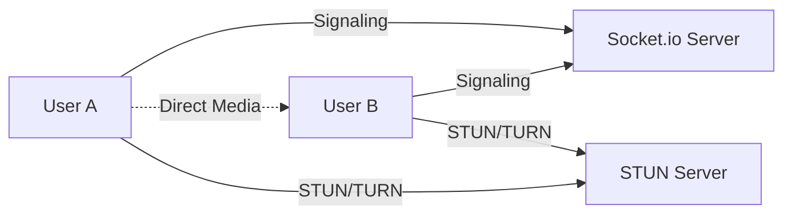

## Overview

EduStream uses WebRTC (Web Real-Time Communication) to enable peer-to-peer audio and video calls. WebRTC allows direct browser-to-browser communication with minimal latency.

## What is WebRTC?

WebRTC is a free, open-source project that provides web browsers and mobile applications with real-time communication via simple APIs. It enables:

- **Audio/Video Streaming**: Direct peer-to-peer media transmission
- **Data Channels**: Exchange arbitrary data between peers
- **Low Latency**: Direct connections reduce delay
- **Built-in Security**: Encryption is mandatory

<Note>
  While WebRTC enables peer-to-peer connections, signaling (exchanging connection information) requires a server. EduStream uses Socket.io for signaling.
</Note>

## WebRTC Architecture



## Implementation

### ICE Server Configuration

Configure STUN servers for NAT traversal:

```javascript
const servers = {
  iceServers: [
    {
      urls: [
        'stun:stun1.l.google.com:19302',
        'stun:stun2.l.google.com:19302'
      ],
    },
  ],
}
```

<Info>
  **STUN servers** help peers discover their public IP addresses and the type of NAT they're behind. Google provides free public STUN servers.
</Info>

### Accessing User Media

<Steps>
  <Step title="Request Media Permissions">
    Use the MediaDevices API to access the user's camera and microphone:

    ```javascript
    async function setupLocalMedia() {
      try {
        localStream.value = await navigator.mediaDevices.getUserMedia({
          video: false,
          audio: true
        })
        
        if (localVideo.value) {
          localVideo.value.srcObject = localStream.value
        }
      } catch (error) {
        console.error('Error accessing media', error)
      }
    }
    ```

    <Warning>
      Always handle errors gracefully. Users might deny permissions or have no camera/microphone available.
    </Warning>
  </Step>

  <Step title="Configure Media Constraints">
    Customize audio and video settings:

    ```javascript
    const constraints = {
      audio: {
        echoCancellation: true,
        noiseSuppression: true,
        autoGainControl: true
      },
      video: {
        width: { ideal: 1280 },
        height: { ideal: 720 },
        frameRate: { ideal: 30 }
      }
    }

    const stream = await navigator.mediaDevices.getUserMedia(constraints)
    ```
  </Step>

  <Step title="Display Local Stream">
    Attach the stream to a video element:

    ```vue
    <video 
      ref="localVideo" 
      autoplay 
      playsinline 
      muted
      class="transform -scale-x-100"
    ></video>
    ```

    <Note>
      The `muted` attribute prevents audio feedback. The `transform -scale-x-100` class mirrors the video for a natural preview.
    </Note>
  </Step>
</Steps>

### Creating Peer Connection

<Steps>
  <Step title="Initialize RTCPeerConnection">
    Create a new peer connection with ICE servers:

    ```javascript
    function createPeerConnection() {
      peerConnection.value = new RTCPeerConnection(servers)
      
      // Add local tracks
      localStream.value.getTracks().forEach((track) => {
        peerConnection.value.addTrack(track, localStream.value)
      })
    }
    ```
  </Step>

  <Step title="Handle Remote Tracks">
    Listen for incoming media tracks:

    ```javascript
    peerConnection.value.ontrack = (event) => {
      remoteStream.value = event.streams[0]
      
      if (remoteVideo.value) {
        remoteVideo.value.srcObject = remoteStream.value
      }
    }
    ```
  </Step>

  <Step title="Handle ICE Candidates">
    Exchange ICE candidates through Socket.io:

    ```javascript
    peerConnection.value.onicecandidate = (event) => {
      if (event.candidate) {
        socket.emit('ice-candidate', {
          candidate: event.candidate,
          to: targetId,
        })
      }
    }
    ```

    <Info>
      ICE candidates contain information about how to reach your peer (IP addresses and ports).
    </Info>
  </Step>
</Steps>

### Establishing Connection

#### Caller Side (Offer)

```javascript
async function startCall() {
  createPeerConnection()
  
  // Create offer
  const offer = await peerConnection.value.createOffer()
  await peerConnection.value.setLocalDescription(offer)
  
  // Send offer via Socket.io
  socket.emit('call-user', {
    userToCall: targetId,
    signalData: offer,
    from: userData.id,
    name: userData.name,
    avatar: userData.photo,
  })
}
```

#### Receiver Side (Answer)

```javascript
async function handleReceiveCall(offerSignal) {
  createPeerConnection()
  
  // Set remote description
  await peerConnection.value.setRemoteDescription(
    new RTCSessionDescription(offerSignal)
  )
  
  // Create answer
  const answer = await peerConnection.value.createAnswer()
  await peerConnection.value.setLocalDescription(answer)
  
  // Send answer via Socket.io
  socket.emit('make-answer', {
    signal: answer,
    to: targetId,
  })
}
```

### Complete Call Flow

<Steps>
  <Step title="Caller initiates">
    1. Caller creates offer
    2. Sends offer to callee via signaling server
  </Step>

  <Step title="Callee responds">
    1. Callee receives offer
    2. Creates and sends answer
  </Step>

  <Step title="ICE exchange">
    Both peers exchange ICE candidates
  </Step>

  <Step title="Connection established">
    Direct peer-to-peer connection is established
  </Step>
</Steps>

## Media Control

### Toggle Audio

```javascript
function toggleAudio() {
  isAudioEnabled.value = !isAudioEnabled.value
  localStream.value.getAudioTracks().forEach((track) => {
    track.enabled = isAudioEnabled.value
  })
}
```

### Toggle Video

```javascript
function toggleVideo() {
  isVideoEnabled.value = !isVideoEnabled.value
  localStream.value.getVideoTracks().forEach((track) => {
    track.enabled = isVideoEnabled.value
  })
}
```

### End Call

```javascript
function endCall(emitEvent = true) {
  // Notify peer
  if (emitEvent && socket) {
    socket.emit('end-call', { to: targetId })
  }
  
  // Stop all tracks
  if (localStream.value) {
    localStream.value.getTracks().forEach((track) => track.stop())
  }
  
  // Close peer connection
  if (peerConnection.value) {
    peerConnection.value.close()
  }
}
```

## Vue Component Integration

### Component Structure

```vue
<template>
  <div>
    <!-- Remote video -->
    <video 
      ref="remoteVideo" 
      autoplay 
      playsinline
      class="w-full h-full"
    ></video>
    
    <!-- Local video (preview) -->
    <video 
      ref="localVideo" 
      autoplay 
      playsinline 
      muted
      class="absolute bottom-4 right-4 w-32 h-24 rounded-lg"
    ></video>
    
    <!-- Controls -->
    <button @click="toggleAudio">Toggle Audio</button>
    <button @click="endCall">End Call</button>
  </div>
</template>

<script setup>
import { ref, onMounted, onBeforeUnmount } from 'vue'
import socket from '@/services/socket.js'

const localVideo = ref(null)
const remoteVideo = ref(null)
const localStream = ref(null)
const peerConnection = ref(null)

onMounted(async () => {
  await setupLocalMedia()
  // Setup WebRTC...
})

onBeforeUnmount(() => {
  // Cleanup
  if (localStream.value) {
    localStream.value.getTracks().forEach(track => track.stop())
  }
  if (peerConnection.value) {
    peerConnection.value.close()
  }
})
</script>
```

## Socket Integration

WebRTC signaling events through Socket.io:

<CodeGroup>
```javascript Receiving Call Answer
socket.on('call-answered', async (data) => {
  await peerConnection.value.setRemoteDescription(
    new RTCSessionDescription(data.signal)
  )
})
```

```javascript Receiving ICE Candidate
socket.on('ice-candidate', async (data) => {
  if (peerConnection.value) {
    try {
      await peerConnection.value.addIceCandidate(
        new RTCIceCandidate(data.candidate)
      )
    } catch (e) {
      console.error('Error adding ice candidate', e)
    }
  }
})
```

```javascript Call Ended
socket.on('call-ended', () => {
  endCall(false)
})
```
</CodeGroup>

## Connection States

Monitor peer connection state:

```javascript
peerConnection.value.onconnectionstatechange = () => {
  const state = peerConnection.value.connectionState
  
  switch (state) {
    case 'connected':
      console.log('Peers connected!')
      break
    case 'disconnected':
      console.log('Peer disconnected')
      break
    case 'failed':
      console.log('Connection failed')
      endCall()
      break
  }
}
```

## Error Handling

<Warning>
  Always implement robust error handling for production applications.
</Warning>

```javascript
try {
  const offer = await peerConnection.value.createOffer()
  await peerConnection.value.setLocalDescription(offer)
} catch (error) {
  console.error('Failed to create offer:', error)
  // Notify user
}

// Handle media errors
navigator.mediaDevices.getUserMedia(constraints)
  .then(stream => {
    // Success
  })
  .catch(error => {
    if (error.name === 'NotAllowedError') {
      alert('Camera/microphone access denied')
    } else if (error.name === 'NotFoundError') {
      alert('No camera/microphone found')
    }
  })
```

## Performance Optimization

### Adaptive Bitrate

```javascript
const sender = peerConnection.getSenders().find(
  s => s.track?.kind === 'video'
)

if (sender) {
  const parameters = sender.getParameters()
  parameters.encodings[0].maxBitrate = 1000000 // 1 Mbps
  await sender.setParameters(parameters)
}
```

### Stats Monitoring

```javascript
setInterval(async () => {
  const stats = await peerConnection.value.getStats()
  stats.forEach(report => {
    if (report.type === 'inbound-rtp') {
      console.log('Bytes received:', report.bytesReceived)
      console.log('Packets lost:', report.packetsLost)
    }
  })
}, 1000)
```

## Best Practices

<Steps>
  <Step title="Always cleanup resources">
    Stop all media tracks and close peer connections when done.
  </Step>

  <Step title="Handle network changes">
    Implement reconnection logic for network interruptions.
  </Step>

  <Step title="Use TURN servers for production">
    STUN servers might not work behind certain firewalls. Consider TURN servers for reliability.
  </Step>

  <Step title="Implement quality indicators">
    Show connection quality to users (bandwidth, latency, packet loss).
  </Step>

  <Step title="Test on multiple browsers">
    WebRTC implementations vary across browsers. Test thoroughly.
  </Step>
</Steps>

## Troubleshooting

### Common Issues

| Issue | Solution |
|-------|----------|
| No audio/video | Check browser permissions |
| Connection fails | Verify STUN/TURN servers |
| One-way audio | Check firewall settings |
| High latency | Consider adding TURN servers |
| Echo/feedback | Ensure local video is muted |

## Next Steps

<CardGroup cols={2}>
  <Card title="Socket.io Integration" icon="plug" href="/development/socket-integration">
    Learn about the signaling server integration
  </Card>
  <Card title="PeerJS Configuration" icon="network-wired" href="/development/peerjs-configuration">
    Simplify WebRTC with PeerJS wrapper
  </Card>
</CardGroup>